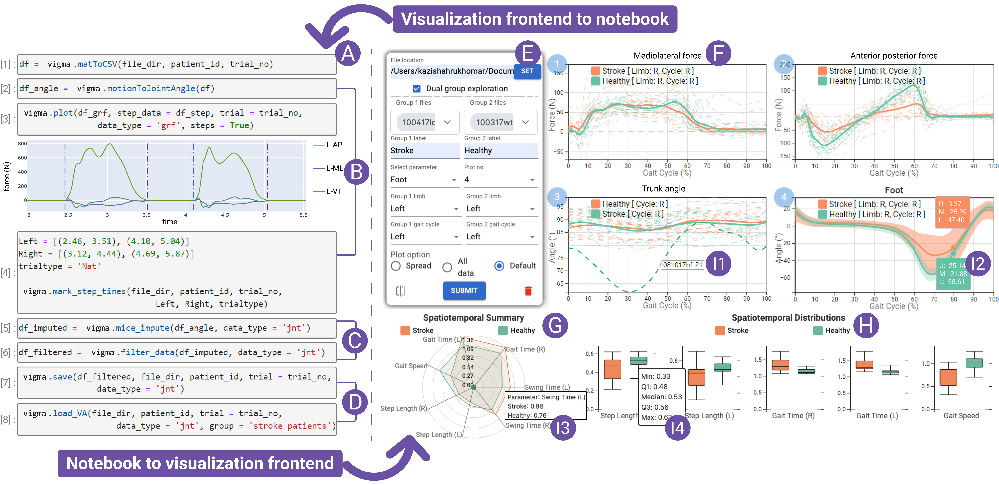
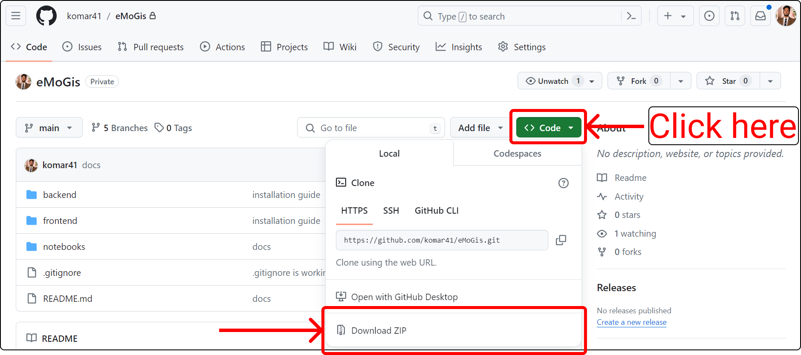
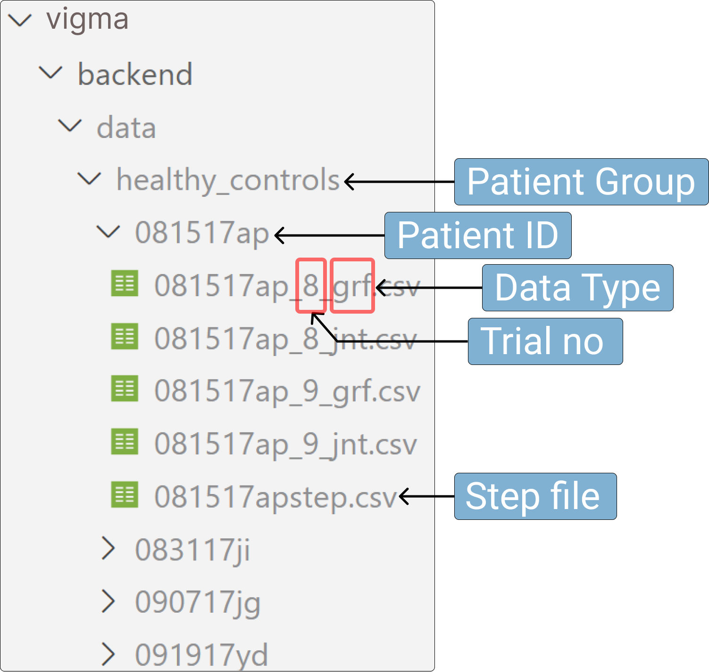

<TODO- Intro. Add image of the system.>

# VIGMA: The Visual Gait and Motion Analytics Framework
This project, VIGMA, is designed to visualize and analyze gait data, providing a comprehensive tool for understanding mobility and balance in various patient populations. VIGMA integrates data processing, analysis, and visualization within a user-friendly framework, making it accessible to researchers, clinicians, and practitioners. The system supports the exploration of disease progression, comparisons across multiple patient groups, and offers advanced visual analytics capabilities. Our goal is to facilitate deeper insights into gait disorders and aid in the development of tailored treatment plans and rehabilitation strategies. VIGMA is open-source and available for use and contribution at [github.com/komar41/VIGMA](https://github.com/komar41/VIGMA).



<div align="center">
    <b>The VIGMA Framework</b>
</div>

## Installation Guide

This guide provides detailed steps to install and set up the VIGMA system, including software installations, project setup, and running the application.

## Software Installations

- Follow this [guide](https://docs.anaconda.com/free/anaconda/install/index.html) to install Anaconda.
- Follow this [link](https://nodejs.org/en/download/) to install Node. Prebuilt binaries/installer is the easiest way to perform installation.
<!-- - Follow this [link](https://code.visualstudio.com/download) to download and install Visual Studio Code (vscode). You may use code editors other than vscode as well. -->

<!-- This short [video]() illustrates how to perform these software installations. -->

## Project Setup

Download a zipped version of VIGMA from [here](https://github.com/komar41/vigma). Check the image below for reference on how to download the zip file from the link.



Unzip the folder. Now, open a terminal inside the **VIGMA** folder.

- Run the following commands in the terminal to install the necessary dependencies for the **VIGMA** Python library (Ignore the lines with hash (**#**). Those are comments explaining each command):

  ```bash
  # Navigate to the notebooks directory
  cd notebooks

  # Create a new conda environment
  conda create --prefix ./envs
  conda config --set env_prompt '({name})'

  # Activate the conda environment
  conda activate ./envs

  # Install necessary Python libraries
  conda install numpy pandas scipy scikit-learn matplotlib ipykernel fuzzywuzzy plotly notebook

  # Install additional Python packages via pip
  pip install c3d
  pip install --upgrade nbformat

  ```

- Now, run the following commands in the terminal to install the necessary dependencies for the **server** side setup.

  ```bash
  # Navigate to the backend directory
  cd ../backend

  # Create a new conda environment
  conda create --prefix ./envs
  conda config --set env_prompt '({name})'

  # Activate the conda environment
  conda activate ./envs

  # Install necessary Python libraries
  conda install flask flask_cors pandas numpy scipy scikit-learn
  ```

- Finally, run the following command in the terminal to install the necessary dependencies for the client side setup.

  ```bash
  # Navigate to the frontend directory
  cd ../frontend

  # Install the necessary client side dependencies.
  npm install --legacy-peer-deps
  ```

<!-- This short [video]() illustrates how to setup the project. -->

## Run the application

- Open a terminal inside the VIGMA folder. Run the following commands in the terminal:

  ```bash
  # Navigate to the backend directory
  cd backend

  # Start the server
  python server.py
  ```

- Open another terminal inside the VIGMA folder. Run the following commands in the terminal:

  ```bash
  # Navigate to the frontend directory
  cd frontend

  # Start the web application
  npm start
  ```

  This will open a tab in your browser and you're all set to use **VIGMA** visual analytics (VA) system. We added some mock data inside the **"vigma/backend/data"** folder to illustrate the usage of the system. You should follow the same hierarchy and naming conventions for data storage displayed in the image below:

  

<!-- This short [video]() illustrates how to run the application and generate visualizations. -->

<TODO- Heading- Data Formats. For GRF JNT STEP. Add SS of csvs.>

## Use the Python API

Follow this [link](https://github.com/komar41/vigma/blob/main/notebooks/README.md) to learn how to use the **VIGMA** python API. 
<!-- You can also watch this short [video tutorial]() to learn the usage of the Python API. -->
