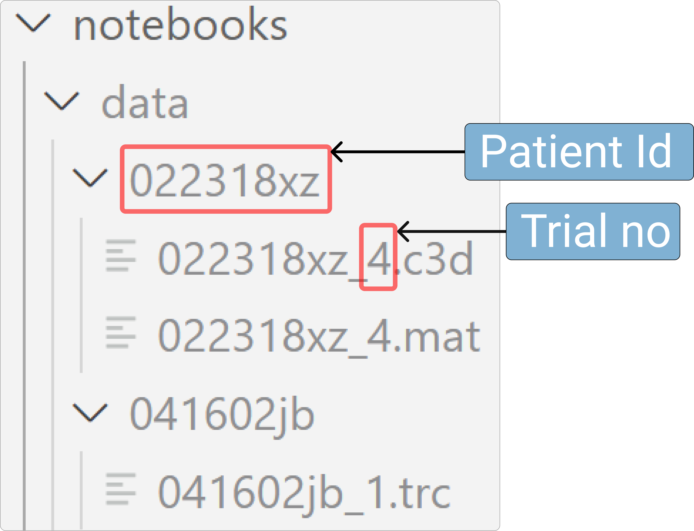

# VIGMA Python: How to Use

<!-- Open Anaconda Prompt. Change directory to vigma->notebook folder location. Open jupyter notebook. Create a new one or use _tutorial.ipynb. But mention that the notebook has to be inside vigma->notebooks folder. -->

The python API for **VIGMA** is designed to facilitate a variety of tasks related to motion/gait data. The main functionalities are grouped into the following categories:

- [**Format harmonization**](#format-harmonization): Convert motion capture files from various formats (TRC, MAT, C3D) to CSV files for easier handling and analysis.
- [**Feature extraction**](#feature-extraction): Extract meaningful features from the motion capture data to joint angles, spatiotemporal parameters, step times, and more.
- [**Data preparation**](#data-preparation): Impute missing data, normalize data to specific gait cycles, and filter data to remove noise.
- [**Data managment**](#data-management): Save and read data files, load data into the Visual Analytics (VA) system.
- [**Utility functions**](#utility-functions): Plot data for visualization.

We have provided some mock data to let the users test the utilities of the library. The mock data should be inside **"vigma/notebooks/data"** folder. You should follow the same hierarchy and naming conventions for data storage displayed in the image below.



You can also check out this [notebook](https://github.com/komar41/vigma/blob/main/notebooks/tutorial.ipynb) that illustrates how to use all functionalities of **VIGMA** Python API.

<a name="format-harmonization"></a>

## 1. Format harmonization

<!-- Add replace to all three function parameters -->

### `trcToCSV()` / `matToCSV()` / `c3dToCSV()`

- Converts a TRC or, MAT or, C3D file to a CSV file, stores in the same directory from where data is read and returns the resulting DataFrame.

**Parameters:**

- `file_dir (str)`: The directory where the TRC/MAT/C3D file is located.
- `patient_id (str)`: The ID of the patient.
- `trial_no (int)`: The trial number.
- `replace (bool)` [<span style="color:red">optional</span>]: If set to True, it will overwrite the existing CSV file. If False or not provided, the function will create a new CSV file.

**Returns:**

- `DataFrame`: The resulting DataFrame after conversion.

**Example:**

```Python
import vigma

file_dir = './data'
patient_id = "041602jb"
trial_no = 1

df = vigma.trcToCSV(file_dir, patient_id, trial_no) # Same for: vigma.matToCSV or, vigma.c3dToCSV.

print(df.head())
```

<a name="feature-extraction"></a>

## 2. Feature extraction

### `motionToJointAngle()`

- Processes the contents of a DataFrame to extract joint angles and optionally saves the result as a CSV file.

**Parameters:**

- `df (DataFrame)`: The DataFrame containing motion data that needs to be processed.
- `save (bool)` [<span style="color:red">optional</span>]: Whether to save the resulting DataFrame as a CSV file (default is False). Saves the joint angle file in the same directory.
- `replace (bool)` [<span style="color:red">optional</span>]: If set to True, it will overwrite the existing CSV file. If False or not provided, the function will create a new CSV file.

**Returns:**

- `DataFrame`: The resulting DataFrame after conversion.

**Example:**

```Python
import vigma

file_dir = './data'
patient_id = "041602jb"
trial_no = 1

df_motion = emogis.read(file_dir, patient_id, trial = trial_no, data_type = 'motion')
df_angle = emogis.motionToJointAngle(df)
print(df_angle.head())
```

### `mark_step_times()`

- Marks the step times for a trial and saves the step information to a CSV file.

**Parameters:**

- `file_dir (str)`: The directory where the data files are located.
- `patient_id (str)`: The ID of the patient.
- `trial (int)`: The trial number.
- `L (list)`: List of tuples containing left foot step times (touch down, toe off).
- `R (list)`: List of tuples containing right foot step times (touch down, toe off).
- `trialtype (str)`: The type of trial (e.g., 'walk')

**Returns:**

- `None`: Saves the step times to a CSV file.

**Example:**

```Python
import vigma

file_dir = './data'
patient_id = "022318xz"
trial = 4

Left = [(2.285, 2.9783), (3.4, 4.0833)]
Right = [(2.8083, 3.5617), (3.9283, 4.7083)]
trialtype = 'walk'

vigma.mark_step_times(file_dir, patient_id, trial, Left, Right, trialtype)
```

### `extract_sptmp()`

- Reads joint angle (CSV) and demographic data (CSV) files, processes the data, and calculates step parameters for **one trial**. Returns the resulting tuple of step parameters for the trial.

**Parameters:**

- `file_dir (str)`: The directory where the data files are located.
- `patient_id (str)`: The ID of the patient.
- `trial (int)`: The trial number.

**Returns:**

- `Tuple`: Contains step parameters (RstepLength, LstepLength, timeRswing, timeLswing, timeRgait, timeLgait, GaitSpeed).

**Example:**

```Python
import vigma

file_dir = "./data"
patient_id = "081517ap"
trial = 8

step_params = vigma.extract_sptmp(file_dir, patient_id, trial)

print("Patient ID: %s, Trial: %d" % (patient_id, trial))

print("RstepLength: %f, LstepLength: %f, timeRswing: %f, timeLswing: %f, timeRGait: %f, timeLGait: %f, GaitSpeed: %f"
      % (step_params[0], step_params[1], step_params[2], step_params[3], step_params[4], step_params[5], step_params[6]))
```

### `get_sptmp_params()`

- Reads joint angle (CSV) and demographic data (CSV) files, processes the data, and calculates step parameters for **all trials** of a patient. Returns the resulting DataFrame.

**Parameters:**

- `file_dir (str)`: The directory where the data files are located.
- `patient_id (str)`: The ID of the patient.

**Returns:**

- `DataFrame`: The resulting DataFrame containing step parameters for all trials.

**Example:**

```Python
import vigma

file_dir = "./data"
patient_id = "081517ap"

df = get_sptmp_params(file_dir, patient_id)
print(df.head())
```

<a name="data-preparation"></a>

## 3. Data preparation

### `interpolate_impute()` / `knn_impute()` / `mice_impute()`

- Imputes missing data in a dataframe using different imputation methods: linear interpolation, K-Nearest Neighbors (KNN), or Multiple Imputation by Chained Equations (MICE).

**Parameters:**

- `df (DataFrame)`: The DataFrame containing the data to be imputed.
- `data_type (str)` [<span style="color:red">optional</span>]: The type of data being imputed (default is 'jnt').

**Returns:**

- `DataFrame`: The resulting DataFrame after conversion.

**Example:**

```Python
import vigma

file_dir = './data'
patient_id = "022318xz"
trial = 4

# Example: Imputing missing data in a joint angle DataFrame
df_motion = vigma.read(file_dir, patient_id, trial=trial_no, data_type='motion')
df_angle = vigma.motionToJointAngle(df_motion)
df_imputed = vigma.mice_impute(df_angle, data_type='jnt')

print(df_imputed.head())
```

### `filter_data()`

- Butterworth filters a dataframe using a specified cutoff frequency and order, then returns the filtered DataFrame.

**Parameters:**

- `df (DataFrame)`: The DataFrame containing the data to be filtered.
- `data_type (str)` [<span style="color:red">optional</span>]: The type of data being filtered (default is 'jnt').
- `cutoff (int)` [<span style="color:red">optional</span>]: Cutoff frequency for the filter (default is `6`).
- `order (int)` [<span style="color:red">optional</span>]: Order of the filter (default is `4`).


**Returns:**

- `DataFrame`: The resulting DataFrame after conversion.

**Example:**

```Python
import vigma

file_dir = './data'
patient_id = "022318xz"
trial = 4

df_motion = vigma.read(file_dir, patient_id, trial=trial_no, data_type='motion')
df_angle = vigma.motionToJointAngle(df_motion)
df_imputed = vigma.mice_impute(df_angle, data_type = 'jnt')
df_filtered = vigma.filter_data(df_imputed, data_type = 'jnt')

print(df_filtered.head())
```

### `normalize_data()`

- Normalizes a dataframe to a specific gait cycle and interpolates it to 100 points.

**Parameters:**

- `df (DataFrame)`: The DataFrame containing the data to be normalized.
- `df_step (DataFrame)`: The DataFrame containing the step times for the patient's trials.
- `patient_id (str)`: The ID of the patient.
- `trial (int)`: The trial number.
- `data_type (str)` [<span style="color:red">optional</span>]: The type of data being normalized: 'grf', 'jnt', or others (default is 'jnt').
- `cycle (str)` [<span style="color:red">optional</span>]: The gait cycle to normalize to ('L' for left, 'R' for right; default is 'L').

**Returns:**

- `DataFrame`: The resulting DataFrame after conversion.

**Example:**

```Python
import vigma

file_dir = './data'
patient_id = "022318xz"
trial_no = 4

df_grf = emogis.read(file_dir, patient_id, trial = trial_no, data_type = 'grf')
df_step = emogis.read(file_dir, patient_id, data_type = 'step_time')

df_normalized = vigma.normalize_data(df_grf, df_step, patient_id, trial_no, data_type = 'grf', cycle = 'L')

print(df_normalized.head())
```

<a name="data-management"></a>

## 4. Data Management

### `save()`
- Saves a DataFrame as a CSV file, handling different types of data and conditions such as normalization and whether to replace existing files.

**Parameters:**
- `df (DataFrame)`: The DataFrame to be saved.
- `file_dir (str)`: The directory where the file should be saved.
- `patient_id (str)`: The ID of the patient.
- `trial (int)` [<span style="color:red">optional</span>]: The trial number (required for certain data types).
- `data_type (str)` [<span style="color:red">optional</span>]: The type of data being saved: 'jnt', 'grf', 'motion', 'sptmp_params', or 'step_time' (default is 'jnt').
- `norm (bool)` [<span style="color:red">optional</span>]: Indicates whether the data has been normalized (default is False).
- `cycle (str)` [<span style="color:red">optional</span>]: The gait cycle ('L' for left, 'R' for right) used in normalization (default is 'L').
- `replace (bool)` [<span style="color:red">optional</span>]: If True, overwrite the existing file. If False, create a new file with a unique name if the file already exists (default is False).

**Returns:**

- `None`.

**Example:**

```Python
import vigma

file_dir = './data'
patient_id = "022318xz"
trial_no = 4

df_motion = vigma.read(file_dir, patient_id, trial=trial_no, data_type='motion')
df_angle = vigma.motionToJointAngle(df_motion)
df_imputed = vigma.mice_impute(df_angle, data_type='jnt')
df_filtered = vigma.filter_data(df_imputed, data_type='jnt')

vigma.save(df_filtered, file_dir, patient_id, trial_no, data_type='jnt', norm=False, replace=True)
```

### `read()`

- Reads a CSV file corresponding to a specific patient, trial, and data type, returning the data as a DataFrame. The function supports different data types and normalized data.

**Parameters:**

- `file_dir (str)`: The directory where the data files are located.
- `patient_id (str)`: The ID of the patient.
- `trial (int)` [<span style="color:red">optional</span>]: The trial number (required for certain data types).
- `data_type (str)` [<span style="color:red">optional</span>]: The type of data to be read: 'jnt', 'grf', 'motion', 'sptmp_params', or 'step_time' (default is 'jnt').
- `norm (bool)` [<span style="color:red">optional</span>]: Indicates whether to read normalized data (default is False).
- `cycle (str)` [<span style="color:red">optional</span>]: The gait cycle ('L' for left, 'R' for right) used in normalization (default is 'L').
- `file_no (int)` [<span style="color:red">optional</span>]: The specific version of the file to read if multiple versions exist.

**Returns:**

- `DataFrame`: The data read from the CSV file.

**Example:**

```Python
import vigma

file_dir = './data'
patient_id = "022318xz"
trial_no = 4

df = vigma.read(file_dir, patient_id, trial=trial_no, data_type='jnt')
print(df.head())
```


### `load_VA()`
- Loads a data file into the VA (Visual Analytics) system under a specified group. The function first checks if the file already exists in the VA system and prompts the user to overwrite it if necessary.

**Parameters:**
- file_dir (str): The directory where the original data file is located.
- patient_id (str): The ID of the patient.
- data_type (str): The type of data to be loaded: 'motion', 'sptmp_params', 'step_time', or normalized data.
- trial (int) [<span style="color:red">optional</span>]: The trial number (required for certain data types).
- group (str) [<span style="color:red">optional</span>]: The group under which the data is to be loaded in the VA system (default is 'misc').
- norm (bool) [<span style="color:red">optional</span>]: Indicates whether to load normalized data (default is False).
- cycle (str) [<span style="color:red">optional</span>]: The gait cycle ('L' for left, 'R' for right) used in normalization (default is 'L').

**Returns:**
- `None`.

```Python
import vigma

file_dir = './data'
patient_id = "022318xz"
trial_no = 4

vigma.load_VA(file_dir, patient_id, data_type='jnt', trial=trial_no, group='misc', norm=False, cycle='L')
```

<a name="utility-functions"></a>

## 5. Utility functions

### `plot()`

- Plots data from a DataFrame, with options to plot joint angles, ground reaction forces (GRF), or other types of data, and to include step events in the plot.

**Parameters:**
- `df (DataFrame)`: The DataFrame containing the data to be plotted.
- `data_type (str)` [<span style="color:red">optional</span>]: The type of data to be plotted: 'jnt' for joint angles, 'grf' for ground reaction forces, or others (default is 'jnt').
- `steps` (bool) [<span style="color:red">optional</span>]: If `True`, step events (toe-offs and touchdowns) will be plotted (default is `False`). Requires step data to be provided in `kwargs`.
- `cycle (bool)` [<span style="color:red">optional</span>]: If `True`, the data will be plotted against the gait cycle percentage instead of time (default is `False`). Overrides steps if both are set to `True`.
- `kwargs`: Additional keyword arguments to be passed to the plot function, including:
  - `step_data (DataFrame)`: The DataFrame containing step events (required if `steps` is `True`).
  - `trial (int)`: The trial number (required if `steps` is `True`).

**Returns:**
- `None`.

**Example:**

```Python
import vigma

file_dir = './data'
patient_id = "022318xz"
trial_no = 4

df = vigma.read(file_dir, patient_id, trial=trial_no, data_type='jnt')
step_data = vigma.read(file_dir, patient_id, data_type='step_time')

vigma.plot(df, data_type='jnt', steps=True, cycle=False, step_data=step_data, trial=trial_no)
```

<!-- Heading- Data Formats. For RAW CSVs. Add SS of csv. SEE grf jnt step formats from here- add link to first notebook SSs. -->

